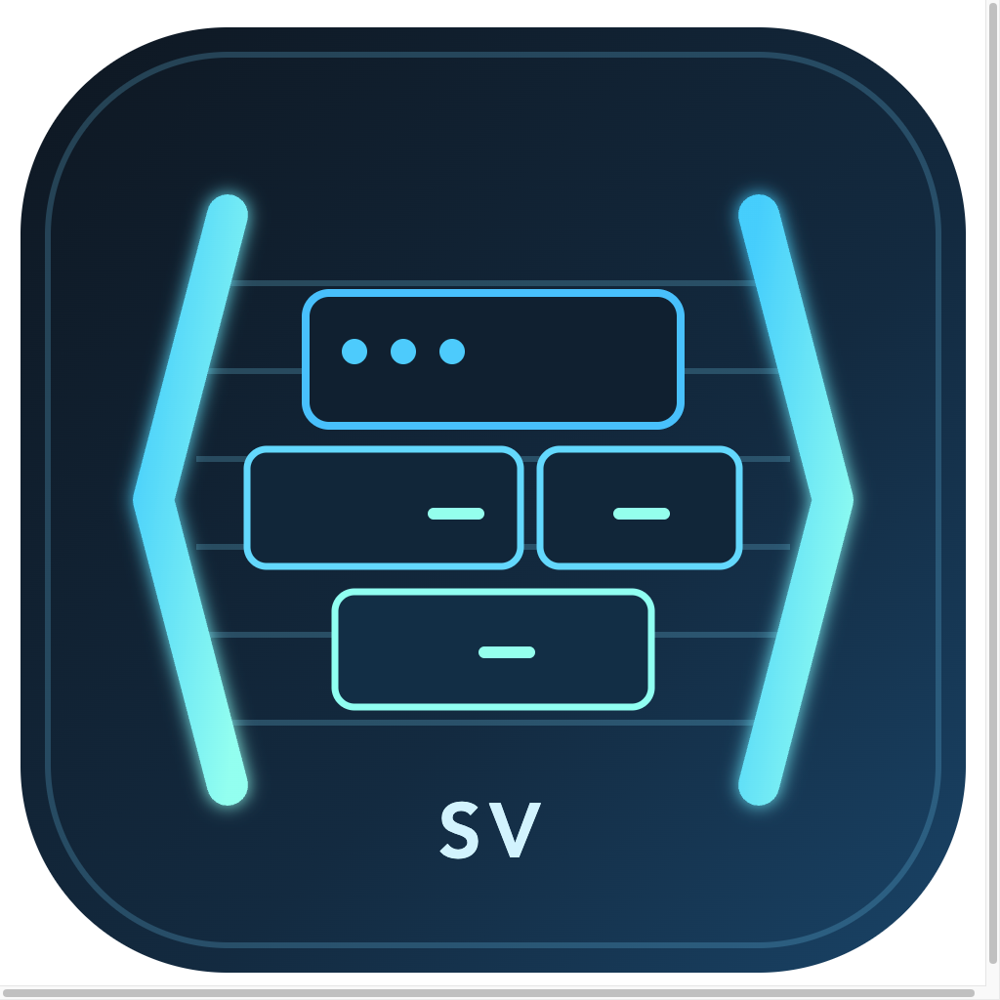
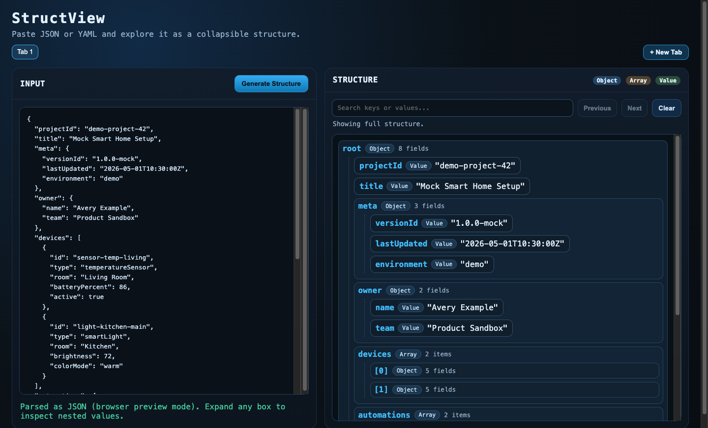

  

<h1 align="center">StructView</h1>

  StructView is a desktop app that makes analyzing and navigating large JSON and YAML files easier.

## Features

- Clean editor with direct paste input
- Supports both JSON and YAML parsing
- Big collapsible structure view for easy exploration
- Expandable object and array nodes with values at every level

## Screenshot

StructView with an example JSON file loaded:

## Run locally

1. Install dependencies:
   `npm install`
2. Start the desktop app:
   `npm start`
